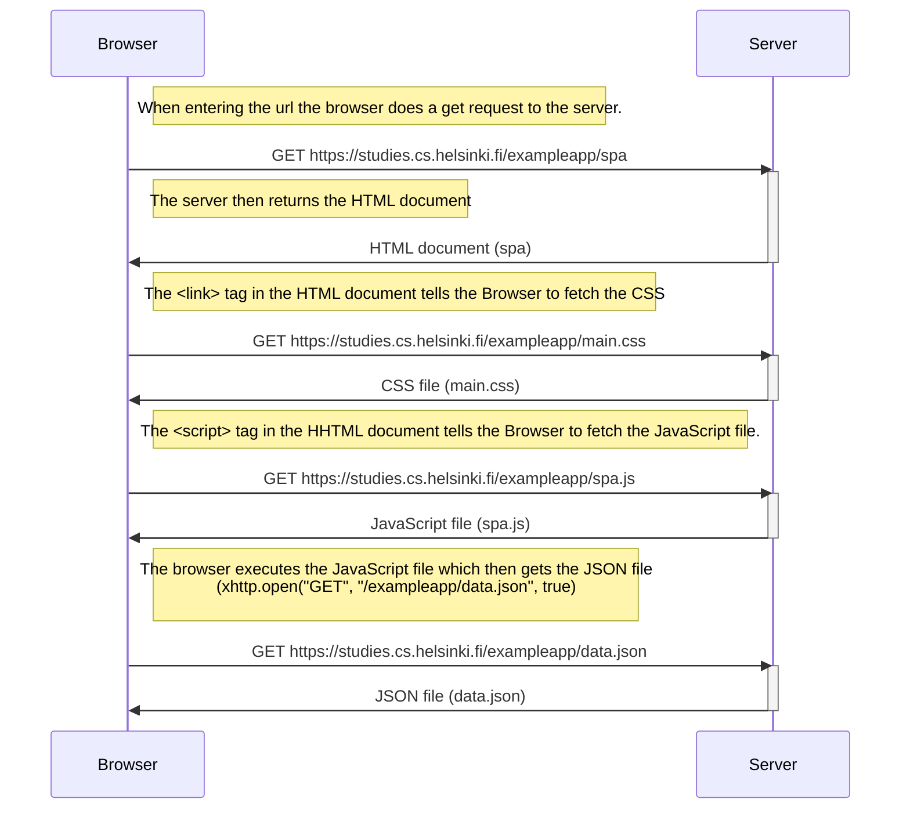

#### Sequence Diagram Exericse 0.5 (Tracing https://studies.cs.helsinki.fi/exampleapp/spa)

```mermaid
sequenceDiagram
    participant Browser
    participant Server

    Note right of Browser: When entering the url the browser does a get request to the server.
    Browser->>Server: GET https://studies.cs.helsinki.fi/exampleapp/spa
    activate Server
    Note right of Browser: The server then returns the HTML document
    Server->>Browser: HTML document (spa)
    deactivate Server

    Note right of Browser: The <link> tag in the HTML document tells the Browser to fetch the CSS
    Browser->>Server: GET https://studies.cs.helsinki.fi/exampleapp/main.css
    activate Server
    Server->>Browser: CSS file (main.css)
    deactivate Server

    Note right of Browser: The <script> tag in the HHTML document tells the Browser to fetch the JavaScript file.
    Browser->>Server: GET https://studies.cs.helsinki.fi/exampleapp/spa.js
    activate Server
    Server->>Browser: JavaScript file (spa.js)
    deactivate Server

    Note right of Browser: The browser executes the JavaScript file which then gets the JSON file <br>(xhttp.open("GET", "/exampleapp/data.json", true)<br>
    Browser->>Server: GET https://studies.cs.helsinki.fi/exampleapp/data.json
    activate Server
    Server->>Browser: JSON file (data.json)
    deactivate Server
```