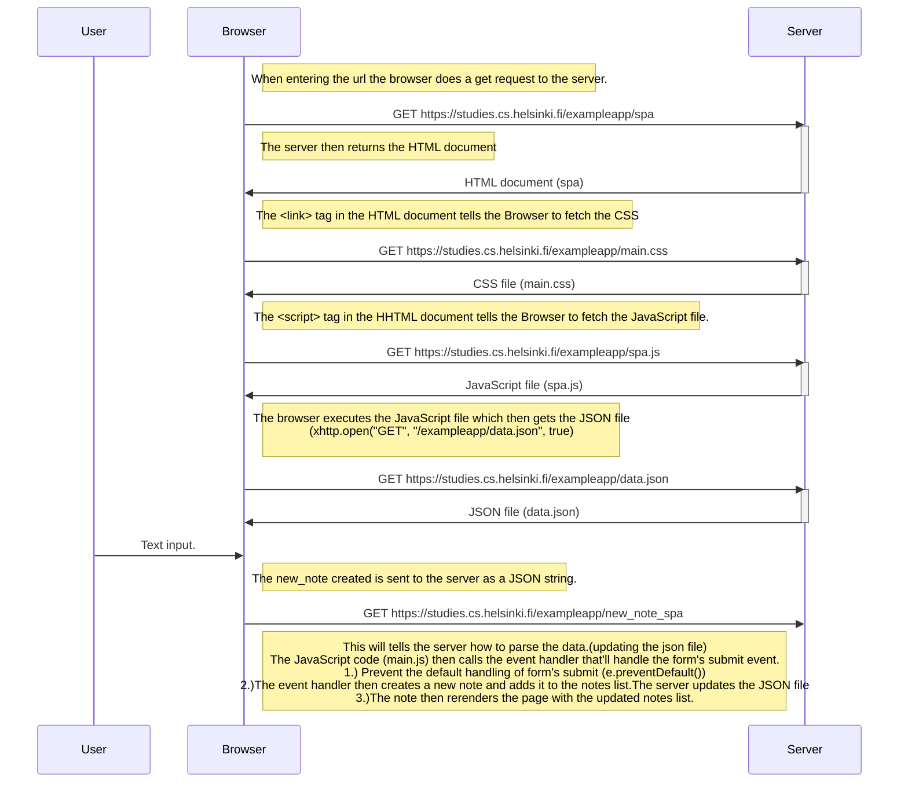

### Sequence Diagram Exercise 0.6(https://studies.cs.helsinki.fi/exampleapp/new_note_spa)

```mermaid
sequenceDiagram
    participant User
    participant Browser
    participant Server

    Note right of Browser: When entering the url the browser does a get request to the server.
    Browser->>Server: GET https://studies.cs.helsinki.fi/exampleapp/spa
    activate Server
    Note right of Browser: The server then returns the HTML document
    Server->>Browser: HTML document (spa)
    deactivate Server

    Note right of Browser: The <link> tag in the HTML document tells the Browser to fetch the CSS
    Browser->>Server: GET https://studies.cs.helsinki.fi/exampleapp/main.css
    activate Server
    Server->>Browser: CSS file (main.css)
    deactivate Server

    Note right of Browser: The <script> tag in the HHTML document tells the Browser to fetch the JavaScript file.
    Browser->>Server: GET https://studies.cs.helsinki.fi/exampleapp/spa.js
    activate Server
    Server->>Browser: JavaScript file (spa.js)
    deactivate Server

    Note right of Browser: The browser executes the JavaScript file which then gets the JSON file <br>(xhttp.open("GET", "/exampleapp/data.json", true)<br>
    Browser->>Server: GET https://studies.cs.helsinki.fi/exampleapp/data.json
    activate Server
    Server->>Browser: JSON file (data.json)
    deactivate Server

    User->>Browser: Text input.
    Note right of Browser: The new_note created is sent to the server as a JSON string. 
    Browser->>Server: GET https://studies.cs.helsinki.fi/exampleapp/new_note_spa
    Note right of Browser:This will tells the server how to parse the data.(updating the json file)<br> The JavaScript code (main.js) then calls the event handler that'll handle the form's submit event.<br>1.) Prevent the default handling of form's submit (e.preventDefault())<br>2.)The event handler then creates a new note and adds it to the notes list.The server updates the JSON file<br> 3.)The note then rerenders the page with the updated notes list.
    
```